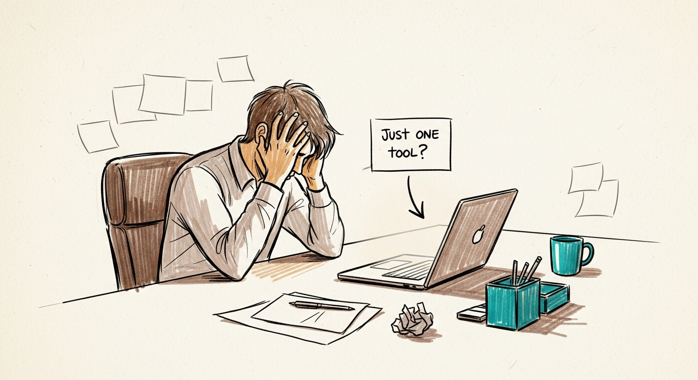
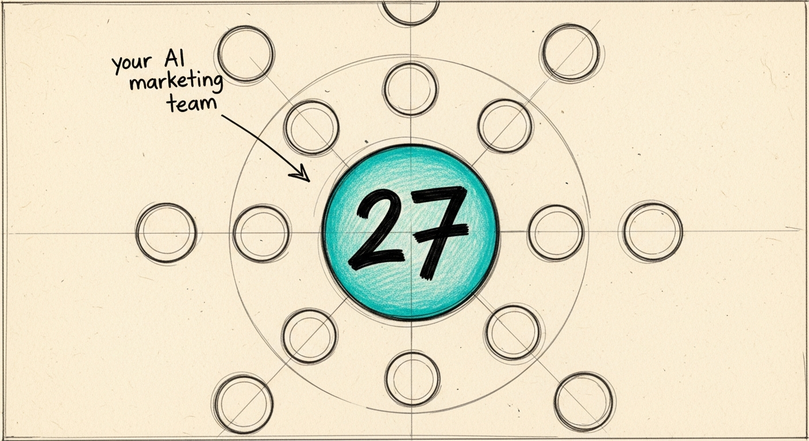
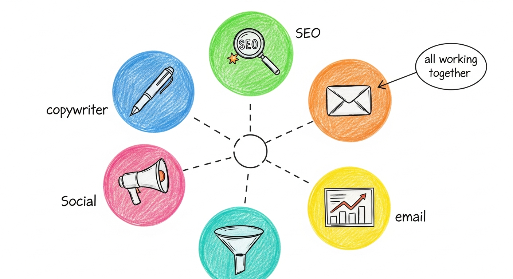
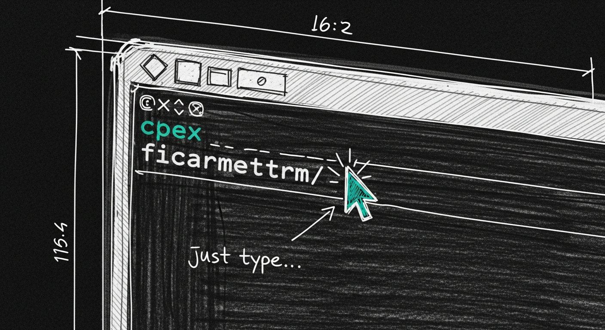
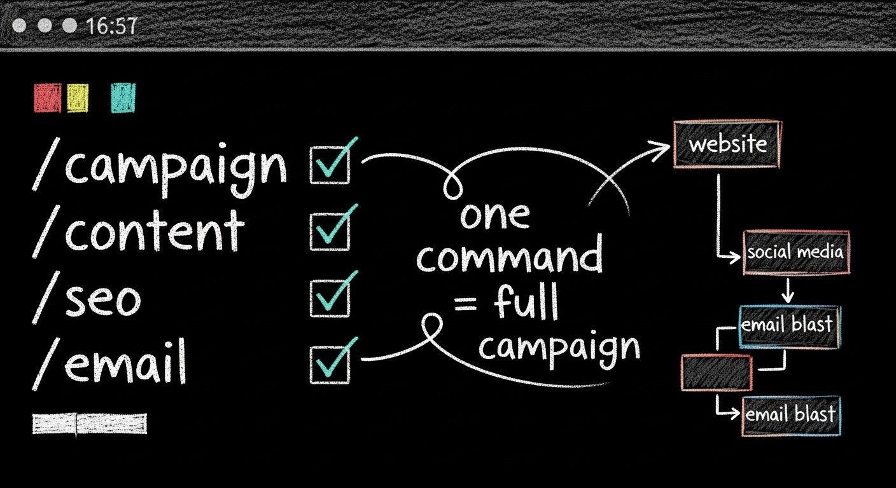
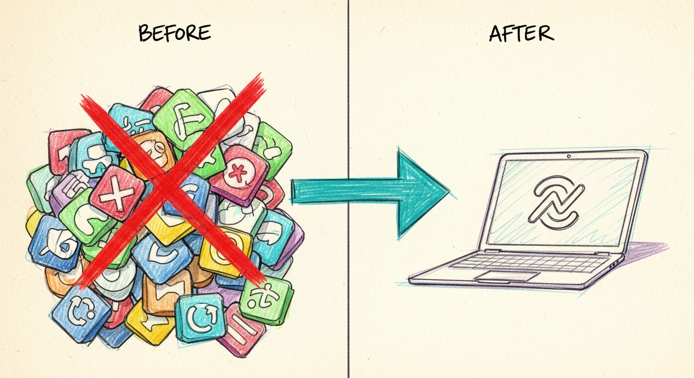
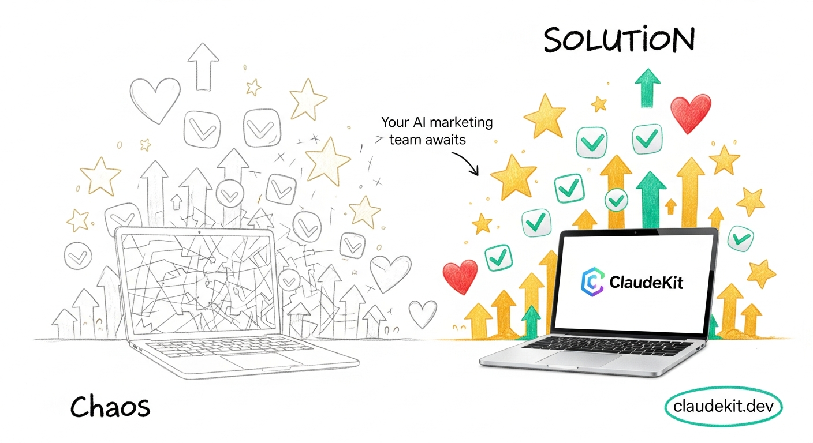

# Storyboard: AntigravityKit Marketing - Top 4 Features

**Generated:** 2025-12-17 | **Aspect:** 16:9 | **Duration:** 32s | **Platform:** YouTube

---

## Overview

A 32-second feature-focused intro video showcasing AntigravityKit Marketing's 4 killer features. Uses "Colored Sketch + Handwriting Annotations" art style for a dynamic, educational storyboard feel.

## Target Audience

Indie hackers, small marketing teams, SMB marketing managers overwhelmed by marketing tool fragmentation.

## Key Message

AntigravityKit Marketing replaces 5-10 separate tools with one unified AI marketing system powered by 27 specialized agents.

## Art Style

**Colored Sketch + Handwriting Annotations**
- Colored pencil sketch, rough linework, storyboard aesthetic
- Handwritten annotations, arrows, callouts
- Warm neutrals + teal accent color, off-white paper texture
- Visible construction lines, margin notes, circled highlights

---

## Scene 1: Hook - The Tool Chaos (0:00-0:08)

| Property | Value |
|----------|-------|
| Timing | 0:00-0:08 |
| Duration | 8s |
| Shot | Wide establishing |
| Motion | Static with icon proliferation |

### Start Frame

**Prompt:** Colored pencil sketch storyboard style, wide shot of frustrated marketer at desk, single laptop screen, warm neutrals with teal accents, off-white paper texture, rough linework, handwritten annotation arrow pointing to laptop saying "just one tool?", margin notes visible, animatic style, 16:9 aspect ratio, no readable text except handwritten notes

**Style Tags:** colored pencil sketch, storyboard, handwritten annotations, animatic style, rough linework, paper texture

**Validation:**
- Required elements: desk, person silhouette, laptop, handwritten arrow annotation
- Forbidden: photorealistic, clean vector, readable brand text
- Quality threshold: 8/10

### End Frame

**Prompt:** Same colored pencil sketch storyboard style, marketer now surrounded by 8+ floating app icons (email, social, analytics, CRM, SEO, ads, CMS, calendar) drawn in sketch style, chaotic scribble lines connecting them, handwritten annotation "5-10 tools = chaos" with arrow, red pencil accent on notification badges, warm neutrals with teal and red accents, off-white paper texture, 16:9 aspect ratio

**Style Tags:** colored pencil sketch, storyboard, handwritten annotations, animatic style, rough linework, paper texture, chaotic

**Validation:**
- Required elements: person, laptop, 8+ floating sketched icons, handwritten annotation, chaos lines
- Forbidden: photorealistic, clean UI
- Continuity: same person, same desk, same angle
- Quality threshold: 8/10

### Audio

- **VO:** "Still juggling 5 different marketing tools? There's a better way."
- **Music:** Playful tension, slightly chaotic melody, 105 BPM
- **SFX:**
  - 0:00 - Paper rustle
  - 0:03 - Rapid pencil scribble sounds
  - 0:06 - Frustrated sigh

### Motion Directive

Static camera, icons appear one by one with sketch-draw animation, chaos lines connect them

### Review Notes

- Sketch style should feel hand-drawn, not AI-generated vector
- Icons should be simple recognizable shapes (envelope, graph, megaphone)
- Handwritten notes add personality and educational feel
- Paper texture visible throughout

---

## Scene 2: Feature 1 - 27 AI Agents (0:08-0:16)

| Property | Value |
|----------|-------|
| Timing | 0:08-0:16 |
| Duration | 8s |
| Shot | Medium visualization |
| Motion | Agents emerge and connect |

### Start Frame

**Prompt:** Colored pencil sketch storyboard style, central circular hub with "27" written in bold handwriting, surrounded by empty circle placeholders in a orbital pattern, handwritten annotation "your AI marketing team" with arrow pointing to center, teal accent color for hub, warm paper texture, rough construction lines visible, 16:9 aspect ratio

**Style Tags:** colored pencil sketch, storyboard, handwritten annotations, animatic style, diagram style, organizational

**Validation:**
- Required elements: central hub with "27", orbital placeholder circles, handwritten annotation
- Forbidden: photorealistic, 3D render, clean graphics
- Quality threshold: 8/10

### End Frame

**Prompt:** Same colored pencil sketch style, central hub now connected to 6 filled agent circles with simple icon sketches inside (pen for copywriter, magnifying glass for SEO, envelope for email, megaphone for social, funnel shape, chart), colorful pencil fills (blue, green, orange, pink, teal, yellow), dashed lines connecting to center, handwritten labels "copywriter", "SEO", "email" near respective icons, annotation "all working together" with circled highlight, 16:9 aspect ratio

**Style Tags:** colored pencil sketch, storyboard, handwritten annotations, colorful, connected, team

**Validation:**
- Required elements: hub, 6 colored agent circles with icons, connecting lines, handwritten labels
- Forbidden: photorealistic, complex illustrations
- Continuity: same hub position, same composition
- Quality threshold: 8/10

### Audio

- **VO:** "AntigravityKit Marketing gives you 27 specialized AI agents. Copywriter. SEO. Email. Social. All working as one team."
- **Music:** Building energy, adding instruments, 105 BPM
- **SFX:**
  - 0:09 - Soft pop sound per agent appear
  - 0:14 - Connection whoosh

### Motion Directive

Agents fill in sequentially with sketch-draw animation, lines connect with dashed animation

### Review Notes

- Agent icons should be simple, recognizable sketches
- Colors should be distinct but harmonious pastel-sketch tones
- Handwritten labels add clarity without clutter
- This is feature showcase - should feel organized despite sketch style

---

## Scene 3: Feature 2 - Slash Commands (0:16-0:24)

| Property | Value |
|----------|-------|
| Timing | 0:16-0:24 |
| Duration | 8s |
| Shot | Close-up terminal |
| Motion | Commands typing animation |

### Start Frame

**Prompt:** Colored pencil sketch storyboard style, close-up of terminal window drawn in sketch style, dark background with sketch texture, cursor blinking represented as small rectangle, handwritten annotation "just type..." with arrow pointing to command line, teal accent on cursor, construction sketch lines visible around terminal frame, 16:9 aspect ratio

**Style Tags:** colored pencil sketch, storyboard, terminal, code aesthetic, handwritten annotations

**Validation:**
- Required elements: terminal sketch, cursor, handwritten annotation
- Forbidden: photorealistic screenshot, clean vector UI
- Quality threshold: 8/10

### End Frame

**Prompt:** Same colored pencil sketch style terminal, now showing handwritten slash commands "/campaign", "/content", "/seo", "/email" stacked vertically in chalk-like white on dark sketch terminal, each with small teal checkmark, handwritten annotation "one command = full campaign" circled, small workflow diagram sketched to the side showing command flowing to multiple outputs, 16:9 aspect ratio

**Style Tags:** colored pencil sketch, storyboard, terminal, commands, workflow diagram, handwritten

**Validation:**
- Required elements: terminal with commands, checkmarks, workflow diagram sketch, annotation
- Forbidden: photorealistic, actual screenshots
- Continuity: same terminal frame, same composition
- Quality threshold: 8/10

### Audio

- **VO:** "Just type slash-campaign, slash-content, slash-SEO. One command triggers your entire workflow."
- **Music:** Rhythmic clicks matching command rhythm, 110 BPM
- **SFX:**
  - 0:17 - Keyboard typing sounds
  - 0:20 - Success ding per checkmark
  - 0:23 - Satisfying completion sound

### Motion Directive

Commands appear as if being typed, checkmarks animate in sequence

### Review Notes

- Commands should look hand-written, not typed font
- Terminal should feel sketched but readable
- Workflow diagram adds context to power of commands
- Typing rhythm should sync with voiceover

---

## Scene 4: CTA - Transform Your Marketing (0:24-0:32)

| Property | Value |
|----------|-------|
| Timing | 0:24-0:32 |
| Duration | 8s |
| Shot | Wide triumphant |
| Motion | Static with upward particles |

### Start Frame

**Prompt:** Colored pencil sketch storyboard style, split composition: left side shows crossed-out pile of app icons from scene 1 (red X marks), right side shows clean single laptop with AntigravityKit logo sketch, large handwritten arrow from chaos to simplicity, annotation "before / after" at top, warm paper texture, teal and purple accents, 16:9 aspect ratio

**Style Tags:** colored pencil sketch, storyboard, before-after, transformation, handwritten annotations

**Validation:**
- Required elements: crossed-out chaos side, clean solution side, transformation arrow, before/after label
- Forbidden: photorealistic, complex graphics
- Quality threshold: 8/10

### End Frame

**Prompt:** Same colored pencil sketch style, chaos side now faded/erased, solution side prominent with laptop surrounded by upward-floating success indicators (checkmarks, stars, hearts in sketch style), handwritten annotation "your AI marketing team awaits" with arrow to laptop, circled "antigravitykit.dev" in teal at bottom, golden pencil accents for success particles, triumphant composition, 16:9 aspect ratio

**Style Tags:** colored pencil sketch, storyboard, success, triumphant, handwritten annotations, CTA

**Validation:**
- Required elements: laptop, success indicators floating up, CTA annotation, URL
- Forbidden: photorealistic, complex 3D
- Continuity: same laptop, same composition focus
- Quality threshold: 8/10

### Audio

- **VO:** "Stop tool-hopping. Start marketing smarter. AntigravityKit Marketing - your AI marketing team awaits."
- **Music:** Triumphant resolution, major key, 110 BPM, fade out
- **SFX:**
  - 0:25 - Erasing/whoosh for chaos fade
  - 0:28 - Rising sparkle sounds
  - 0:31 - Satisfying final chime

### Motion Directive

Chaos fades out with eraser effect, success particles float upward, brightness increases

### Review Notes

- Transformation should feel satisfying and complete
- CTA URL must be clearly visible and readable
- Success particles add energy without clutter
- Final frame should work as thumbnail

---

## Post-Production Notes

### Text Overlays (Add in editing)

- Scene 1 (0:03): "5-10 Tools" counter appears
- Scene 2 (0:10): "27 AI Agents" highlight
- Scene 3 (0:18): "/" command prefix highlight
- Scene 4 (0:28): "antigravitykit.dev" URL, "Try Free" button

### Color Palette

- Primary: Teal (#14B8A6), Purple (#8B5CF6)
- Paper: Off-white (#FDF6E3)
- Accents: Red (#EF4444) for chaos, Gold (#F59E0B) for success
- Sketch lines: Warm gray (#78716C)

### Music Track

- Style: Playful tech with sketch/educational feel
- Tempo: 105-110 BPM with build
- Key: G major for warmth, E minor for tension (Scene 1)
- Reference: "Whiteboard Explainer" style

### Art Direction Notes

- All frames maintain consistent sketch aesthetic
- Handwritten annotations are key differentiator from generic explainer
- Paper texture visible in all frames
- Colors are pencil-like, not digital-flat

### Final Checklist

- [ ] All frames generated with Imagen 4
- [ ] Frames reviewed for sketch consistency
- [ ] Video clips generated from frame pairs
- [ ] Voiceover recorded/generated
- [ ] Music track composed/selected
- [ ] SFX placed at timestamps
- [ ] Text overlays added
- [ ] Color graded to enhance sketch feel
- [ ] Final review pass

---

## Resources

- Storyboard Format Guide: `~/.antigravity/skills/video-production/references/storyboard-format.md`
- Script Templates: `~/.antigravity/skills/video-production/references/script-templates.md`
- AI Multimodal (Imagen 4): `~/.antigravity/skills/ai-multimodal/skill.md`
