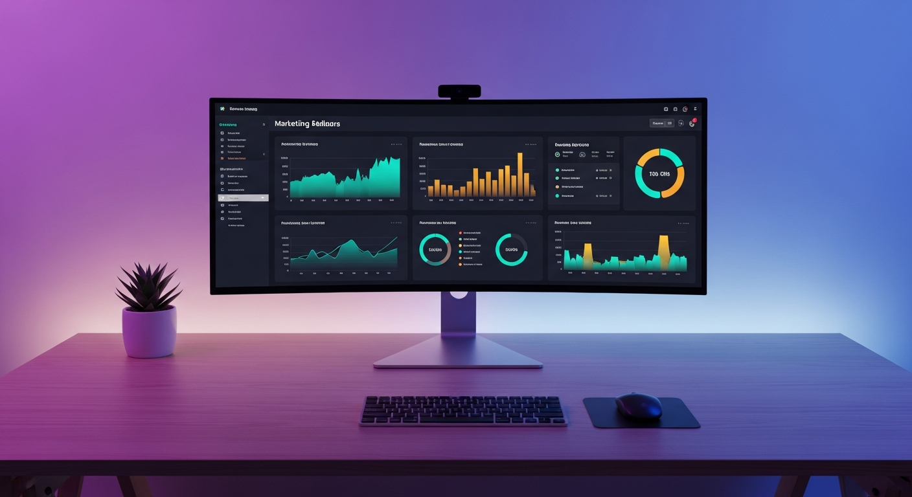
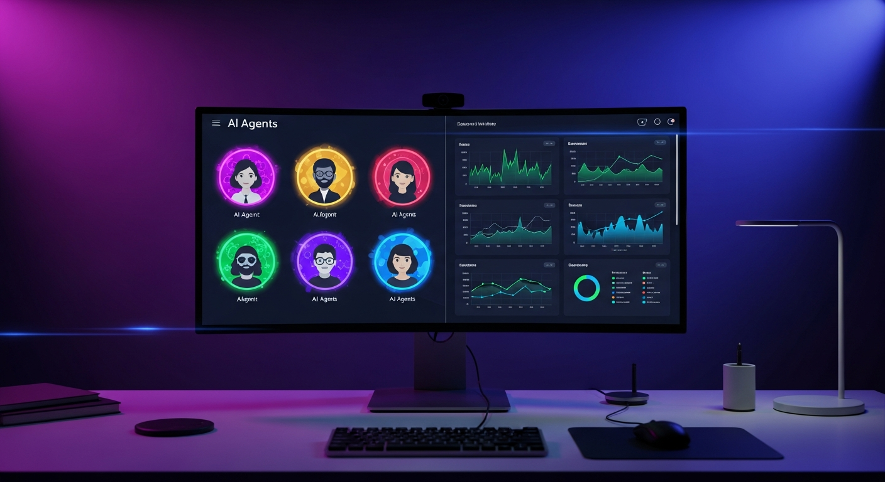
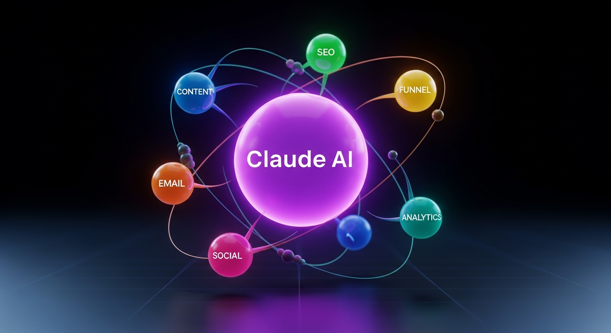
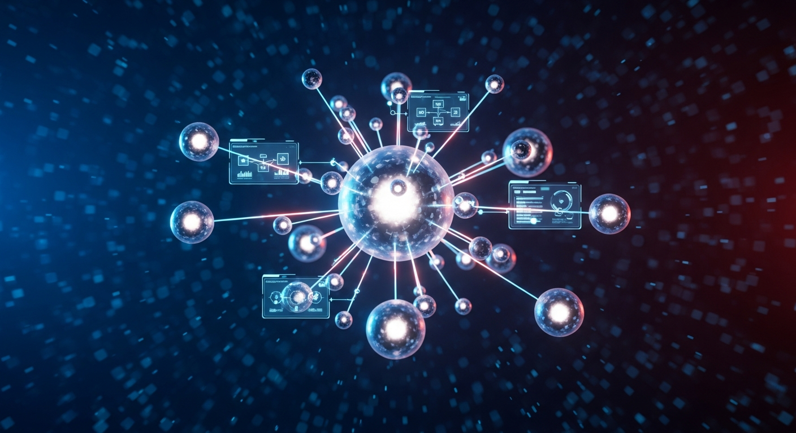
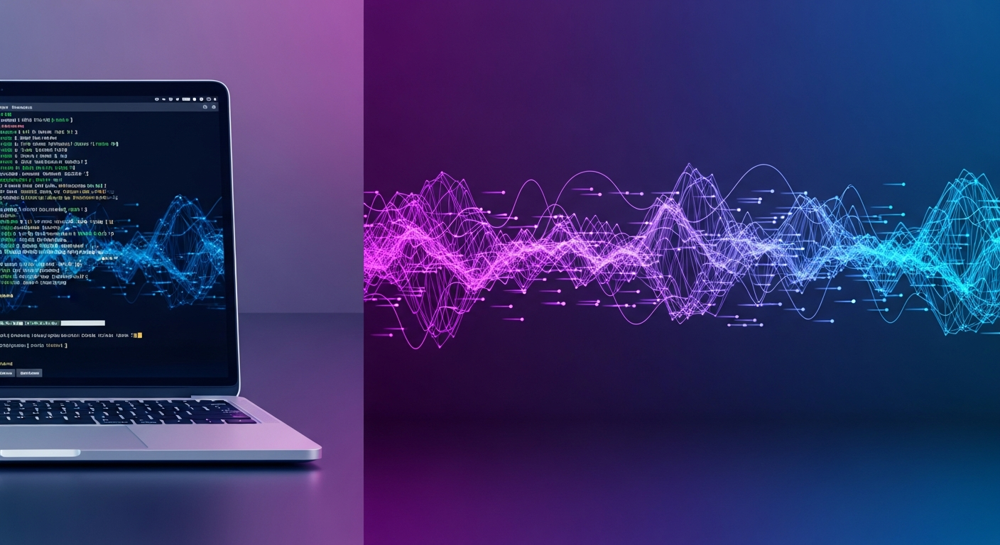

# Storyboard: AntigravityKit Overview Explainer

**Generated:** 2025-12-15 | **Aspect:** 16:9 | **Duration:** 30s | **Platform:** YouTube

---

## Overview

A 30-second explainer video introducing AntigravityKit - the AI-powered marketing automation toolkit. Structure: Hook > Problem > Solution > CTA.

## Target Audience

Indie hackers, small marketing teams, SMB marketing managers looking to automate their marketing workflows with AI.

## Key Message

AntigravityKit turns Google Antigravity into a complete marketing automation platform with specialized AI agents working together.

---

## Scene 1: Hook (0:00-0:07)

| Property | Value |
|----------|-------|
| Timing | 0:00-0:07 |
| Duration | 7s |
| Shot | Wide establishing |
| Motion | Camera static, subtle UI animation |

### Start Frame

**Prompt:** Wide shot of modern minimalist desk setup with ultrawide monitor displaying colorful marketing dashboard, purple and blue gradient ambient lighting, professional photography, clean composition, 16:9 aspect ratio, photorealistic, 4k, cinematic lighting, no text overlays, no watermarks

**Style Tags:** photorealistic, 4k, professional, cinematic, minimalist, tech

**Validation:**
- Required elements: desk, monitor, dashboard UI, ambient lighting
- Forbidden: text, watermarks, people, clutter
- Quality threshold: 8/10

### End Frame

**Prompt:** Same desk setup, monitor now showing split-screen with multiple AI agent avatars in colorful circles, dashboard graphs animating upward, purple and blue gradient ambient lighting, professional photography, clean composition, 16:9 aspect ratio, photorealistic, 4k, cinematic lighting, no text overlays, no watermarks

**Style Tags:** photorealistic, 4k, professional, cinematic, minimalist, tech

**Validation:**
- Required elements: desk, monitor, agent avatars, graphs
- Forbidden: text, watermarks, people
- Continuity: same desk, same lighting, same angle
- Quality threshold: 8/10

### Audio

- **VO:** "What if your marketing could run itself? Meet AntigravityKit."
- **Music:** Modern tech ambient, building energy, 100 BPM, soft synth pads
- **SFX:**
  - 0:00 - Soft woosh transition
  - 0:05 - Subtle notification chime

### Motion Directive

Static camera, subtle dashboard UI animations, agent avatars fade in

### Review Notes

- Check monitor reflections are realistic
- Verify ambient lighting consistent between frames
- Dashboard should feel alive but not cluttered
- No glitchy AI artifacts on screen content

---

## Scene 2: Problem (0:07-0:14)

| Property | Value |
|----------|-------|
| Timing | 0:07-0:14 |
| Duration | 7s |
| Shot | Medium close-up |
| Motion | Slow dolly in |

### Start Frame

**Prompt:** Medium shot of stressed marketer at laptop, surrounded by floating app icons (email, social, analytics, CRM) in disarray, warm office lighting with blue screen glow, shallow depth of field, person slightly blurred showing frustration body language, photorealistic, 4k, cinematic, 16:9 aspect ratio, no text overlays

**Style Tags:** photorealistic, 4k, cinematic, shallow DOF, emotional

**Validation:**
- Required elements: person (blurred/silhouette), laptop, floating icons
- Forbidden: readable text, logos, faces in focus
- Quality threshold: 8/10

### End Frame

**Prompt:** Same scene, camera closer, floating app icons now scattered chaotically with red notification badges, laptop screen showing overwhelming analytics, warm office lighting with blue screen glow, person's hands covering face in frustration, photorealistic, 4k, cinematic, 16:9 aspect ratio, no text overlays

**Style Tags:** photorealistic, 4k, cinematic, shallow DOF, emotional

**Validation:**
- Required elements: person, laptop, chaotic icons, notification badges
- Forbidden: readable text, brand logos, clear face
- Continuity: same person, same lighting, same office
- Quality threshold: 8/10

### Audio

- **VO:** "Juggling content, campaigns, SEO, emails... it's overwhelming."
- **Music:** Slight tension build, minor key progression, 100 BPM
- **SFX:**
  - 0:08 - Rapid notification sounds (subtle)
  - 0:12 - Stressed sigh ambience

### Motion Directive

Slow dolly in toward person, floating icons drift chaotically

### Review Notes

- Person should be anonymous (no clear face)
- Icons should float naturally, not rigidly
- Emotion should be relatable frustration, not extreme distress
- Check for natural hand anatomy

---

## Scene 3: Solution (0:14-0:23)

| Property | Value |
|----------|-------|
| Timing | 0:14-0:23 |
| Duration | 9s |
| Shot | Wide to medium |
| Motion | Dynamic dolly out revealing agents |

### Start Frame

**Prompt:** Abstract visualization of Antigravity AI logo in center, glowing purple orb, surrounded by 6 colorful satellite orbs representing different agents (content-blue, SEO-green, email-orange, social-pink, analytics-teal, funnel-yellow), dark gradient background with subtle grid pattern, futuristic tech aesthetic, photorealistic 3D render, 4k, 16:9 aspect ratio, cinematic lighting, no text

**Style Tags:** 3D render, futuristic, tech, glowing, abstract, colorful

**Validation:**
- Required elements: central orb, 6 satellite orbs, gradient background
- Forbidden: text, readable labels, photographic elements
- Quality threshold: 8/10

### End Frame

**Prompt:** Same abstract visualization, satellite orbs now connected to central orb with glowing energy lines, orbs pulsing with activity, small workflow diagrams emerging between connections, dark gradient background with animated particles, futuristic tech aesthetic, photorealistic 3D render, 4k, 16:9 aspect ratio, cinematic lighting, no text

**Style Tags:** 3D render, futuristic, tech, glowing, abstract, colorful, dynamic

**Validation:**
- Required elements: central orb, 6 connected satellite orbs, energy lines, particles
- Forbidden: text, readable labels
- Continuity: same orb colors, same composition
- Quality threshold: 8/10

### Audio

- **VO:** "AntigravityKit deploys specialized AI agents that work together - content creation, SEO, email campaigns, social media, all orchestrated automatically."
- **Music:** Rising energy, major key resolution, 110 BPM, inspiring synth
- **SFX:**
  - 0:14 - Magical activation sound
  - 0:17 - Connection whoosh (repeating softly)
  - 0:21 - Harmonious completion tone

### Motion Directive

Central orb pulses, satellite orbs orbit slowly, energy connections activate sequentially

### Review Notes

- Colors should be distinct but harmonious
- Energy lines should feel organic, not rigid
- Particles add depth without distraction
- This is the "wow" moment - should feel satisfying

---

## Scene 4: CTA (0:23-0:30)

| Property | Value |
|----------|-------|
| Timing | 0:23-0:30 |
| Duration | 7s |
| Shot | Medium establishing |
| Motion | Static with subtle animation |

### Start Frame

**Prompt:** Split composition showing modern laptop on left with AntigravityKit terminal interface, and abstract flowing data visualization on right representing automation, purple and blue gradient background, clean professional aesthetic, photorealistic, 4k, 16:9 aspect ratio, cinematic lighting, space for text overlay at bottom third

**Style Tags:** photorealistic, 4k, professional, tech, split composition

**Validation:**
- Required elements: laptop, terminal UI, data visualization, gradient background
- Forbidden: readable text on screen, watermarks
- Quality threshold: 8/10

### End Frame

**Prompt:** Same split composition, laptop screen now showing green success indicators, data visualization transformed into upward-trending growth chart, golden particles floating upward representing success, purple and blue gradient background brightening, clean professional aesthetic, photorealistic, 4k, 16:9 aspect ratio, cinematic lighting, space for text overlay at bottom third

**Style Tags:** photorealistic, 4k, professional, tech, optimistic, growth

**Validation:**
- Required elements: laptop with success state, growth visualization, particles
- Forbidden: readable text, brand logos
- Continuity: same laptop, same composition, elevated mood
- Quality threshold: 8/10

### Audio

- **VO:** "Start automating your marketing today. AntigravityKit - your AI marketing team."
- **Music:** Triumphant resolution, 110 BPM, fade out on final beat
- **SFX:**
  - 0:24 - Success chime
  - 0:28 - Soft whoosh to end card

### Motion Directive

Static camera, terminal shows activity, particles rise upward, gentle brightness increase

### Review Notes

- Leave clear space for text overlay (CTA, URL)
- Mood should be optimistic and resolved
- Growth visualization should feel earned, not forced
- Particles should float naturally

---

## Post-Production Notes

### Text Overlays (Add in editing)

- Scene 1: "AntigravityKit" logo fade in at 0:05
- Scene 4: "antigravitykit.dev" URL at 0:25, "Try Free" button at 0:27

### Color Grading

- Primary: Purple (#8B5CF6) and Blue (#3B82F6)
- Accent: Teal (#14B8A6) for success states
- Shadows: Deep purple-black for depth

### Music Track

- Style: Modern tech/corporate ambient
- Tempo: 100-110 BPM with natural build
- Key: C major for resolution, A minor for tension (Scene 2)
- Reference: "Inspiring Corporate" style

### Final Checklist

- [ ] All frames generated and reviewed
- [ ] Video clips generated from frame pairs
- [ ] Voiceover recorded/generated
- [ ] Music track composed/selected
- [ ] SFX placed at timestamps
- [ ] Text overlays added
- [ ] Color graded
- [ ] Final review pass

---

## Resources

- Quality Review Workflow: `../../.antigravity/skills/video-production/references/quality-review-workflow.md`
- Veo Prompt Guide: `../../.antigravity/skills/video-production/references/veo-prompt-guide.md`
- Vision Analysis: `../../.antigravity/skills/ai-multimodal/references/vision-understanding.md`
