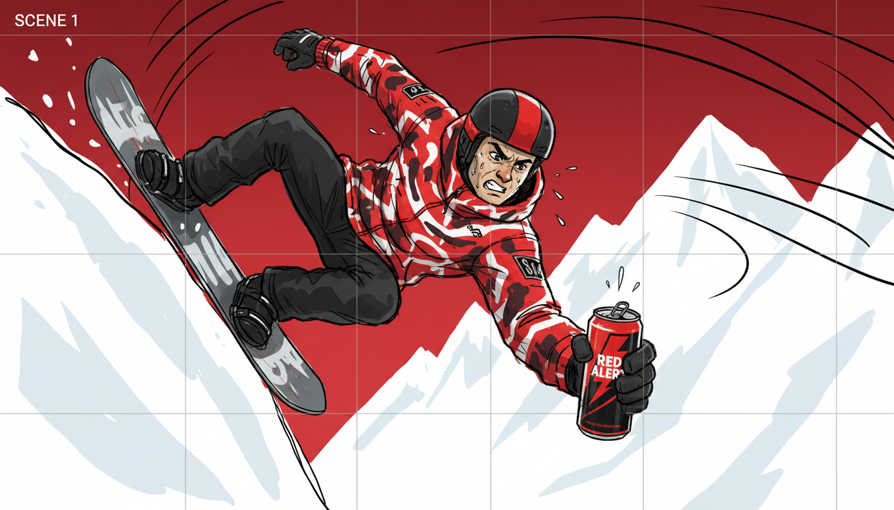
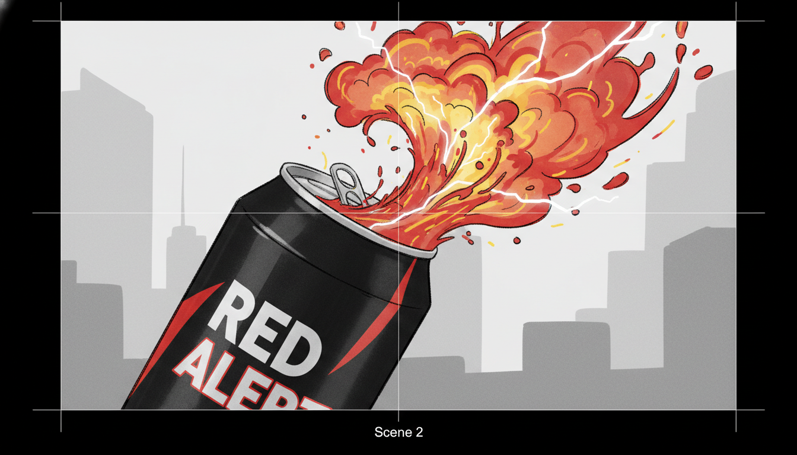
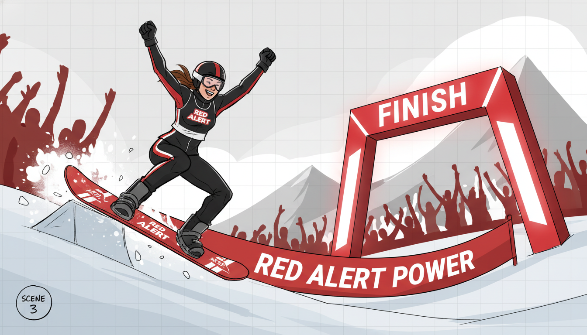
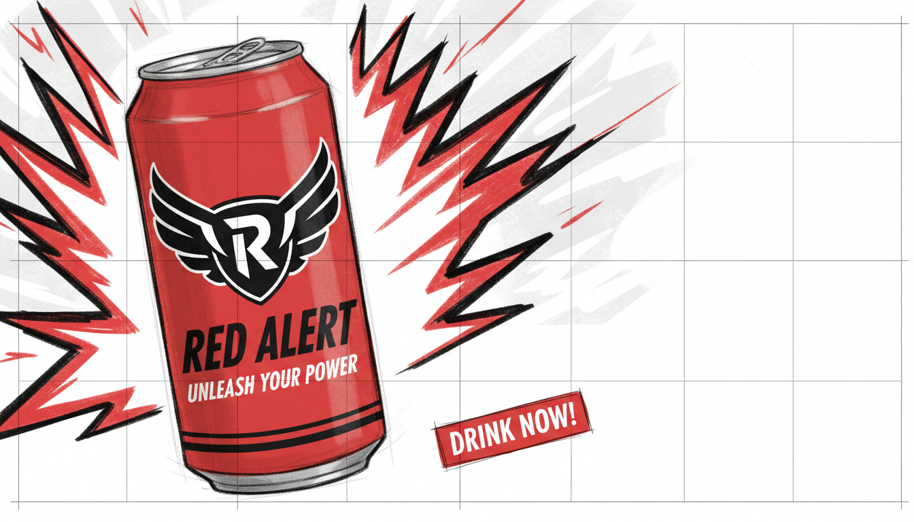

# Storyboard

**Project:** "Red Alert" energy drink commercial - extreme sports
**Generated:** 2025-12-11T08:17:08.299Z
**Aspect Ratio:** 16:9
**Brand Colors:** red, black, white

---

## Frame 1: Extreme Action Hook

| Property | Value |
|----------|-------|
| **Duration** | 2s |
| **Shot Type** | wide shot |
| **Camera Angle** | Eye level |

### Visual Description

High-octane extreme sports moment - athlete mid-action, intense expression, sweat glistening, Red Alert can visible in frame

### Generated Frame

---

## Frame 2: Energy Surge

| Property | Value |
|----------|-------|
| **Duration** | 1.5s |
| **Shot Type** | close-up |
| **Camera Angle** | Eye level |

### Visual Description

Close-up of Red Alert can being opened with dramatic splash, liquid energy radiating outward, vibrant colors exploding

### Generated Frame

---

## Frame 3: Peak Performance

| Property | Value |
|----------|-------|
| **Duration** | 2.5s |
| **Shot Type** | medium shot |
| **Camera Angle** | Eye level |

### Visual Description

Athlete achieving victory moment - crossing finish line, landing trick, scoring goal - powered by Red Alert

### Generated Frame

---

## Frame 4: Brand Reveal CTA

| Property | Value |
|----------|-------|
| **Duration** | 2s |
| **Shot Type** | medium close-up |
| **Camera Angle** | Eye level |

### Visual Description

Red Alert can hero shot with bold logo, tagline text overlay, call-to-action, energy waves in background

### Generated Frame

---

## Usage Instructions

Use the image generation prompts above with your preferred AI image generator:
- **Imagen 4** (Google): Best for storyboard style
- **DALL-E 3** (OpenAI): Good for realistic scenes
- **Midjourney**: Great for artistic interpretations
- **Stable Diffusion**: Good for custom styles
